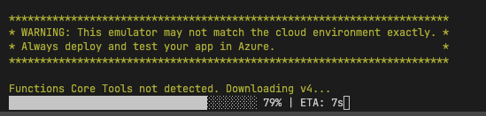

# Add an API to Azure Static Web Apps with Azure Functions

- https://learn.microsoft.com/en-gb/azure/static-web-apps/add-api?tabs=angular
- https://azure.github.io/static-web-apps-cli/docs/use/install

Start in the correct folder

```bash
cd Azure-Angular-Basic
```

Follow instructions of the [tutorial](https://learn.microsoft.com/en-gb/azure/static-web-apps/add-api?tabs=angular):

it will create a folder in the root of the project.

Move the `api` folder in de root, to "Azure-Angular-Basic"

- /Azure-Angular-Basic/src/app/app.module.ts

```ts
import { HttpClientModule } from "@angular/common/http";
import { NgModule } from "@angular/core";
import { BrowserModule } from "@angular/platform-browser";

import { AppRoutingModule } from "./app-routing.module";
import { AppComponent } from "./app.component";

@NgModule({
  declarations: [AppComponent],
  imports: [BrowserModule, HttpClientModule, AppRoutingModule],
  providers: [],
  bootstrap: [AppComponent],
})
export class AppModule {}
```

- /Azure-Angular-Basic/src/app/app.component.ts

```ts
import { HttpClient } from "@angular/common/http";
import { Component } from "@angular/core";

@Component({
  selector: "app-root",
  templateUrl: "./app.component.html",
  styleUrls: ["./app.component.scss"],
})
export class AppComponent {
  title = "azure-angular-basic";

  message = "";

  constructor(private http: HttpClient) {
    this.http
      .get("/api/message")
      .subscribe((resp: any) => (this.message = resp.text));
  }
}
```

- /Azure-Angular-Basic/src/app/app.component.html

```html
<div class="container">
  <h1>{{title}}</h1>
  <p>{{message}}</p>
</div>
```

## install

install globally (usefull for registering `swa` globally) (my recomendation)

```bash
npm install -g @azure/static-web-apps-cli
```

Install in this project as a development dependency using:

```bash
npm install -D @azure/static-web-apps-cli
```

install en build a production version

```bash
npm install
npm run build --prod
```

```bash
swa start dist/azure-angular-basic --api-location api
```

You will get a warning and it will download the Function Core Tools


Press CTRL+C to exit.

http://localhost:4280
