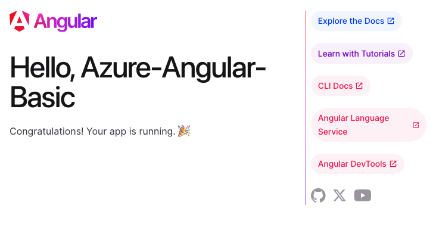

# Clean Version of Microsoft Angular Tutorials

While Microsoft provides valuable tutorials, some users may encounter issues with the Angular projects not functioning as expected. To address this, I've developed a clean version devoid of unnecessary complexities, aimed at providing a smoother learning experience.

## Purpose

This repository aims to offer a simplified version of Microsoft's Angular tutorials, ensuring a straightforward and effective learning journey for users encountering difficulties with the original projects.

## Features

- Simplicity: Stripped off unnecessary features and complexities, focusing solely on the core concepts.
- Clarity: Clear and concise codebase for easier understanding and troubleshooting.
- Compatibility: Designed to work seamlessly with the provided tutorials, ensuring a hassle-free learning experience.

---

## Init Angular project

Create an basic project with Angular CLI

> (at the moment of writing Angular CLI: 17.3.0)

Add routing and use scss (optional) for styling

```bash
ng new Azure-Angular-Basic --routing true --style scss
```

get the question:

- Do you want to enable Server-Side Rendering (SSR) and Static Site Generation (SSG/Prerendering)?

choose "no"

```bash
cd Azure-Angular-Basic
ng serve --open
```



## Learning

- https://learn.microsoft.com/en-gb/azure/static-web-apps/getting-started?tabs=angular

- https://github.com/staticwebdev/angular-basic

small changes

add `staticwebapp.config.json` to the root of this project

```bash
cd Azure-Angular-Basic # if you are not already in the correct folder
touch staticwebapp.config.json
```

copy this in the file

```json
{
  "navigationFallback": {
    "rewrite": "/index.html",
    "exclude": ["*.{css,scss,js,png,gif,ico,jpg,svg}"]
  }
}
```

## Build errors

```
Node.js version v16.20.2 detected.
The Angular CLI requires a minimum Node.js version of v18.13.

Please update your Node.js version or visit https://nodejs.org/ for additional instructions.
```

problem: https://www.npmjs.com/package/@angular/cli?activeTab=versions

- Github/Azure supports Node.js v16.20.2
- Angular CLI 17 supports Node.js v18.13

## Glossary

SWA = (Azure) Static Web App
