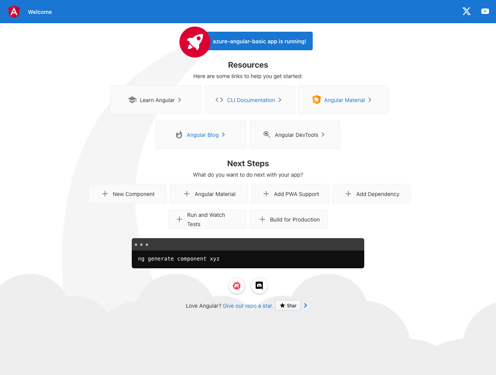

# Clean Version of Microsoft Angular Tutorials

While Microsoft provides valuable tutorials, some users may encounter issues with the Angular projects not functioning as expected. To address this, I've developed a clean version devoid of unnecessary complexities, aimed at providing a smoother learning experience.

## Purpose

This repository aims to offer a simplified version of Microsoft's Angular tutorials, ensuring a straightforward and effective learning journey for users encountering difficulties with the original projects.

## Features

- Simplicity: Stripped off unnecessary features and complexities, focusing solely on the core concepts.
- Clarity: Clear and concise codebase for easier understanding and troubleshooting.
- Compatibility: Designed to work seamlessly with the provided tutorials, ensuring a hassle-free learning experience.

---

## Init Angular project

Create an basic project with Angular CLI

> at the moment of writing Angular CLI: 17.3.0

Make sure you don't use Angular CLI 17 but use Angular CLI 16

[Read more about Angular CLI v16 vs v17](#error)

```bash
npm uninstall -g @angular/cli
npm install -g @angular/cli@16.2.12
```

Add routing and use scss (optional) for styling

```bash
ng new Azure-Angular-Basic --routing true --style scss
```

create a build so you know which folder is used (in this case it will be: `Azure-Angular-Basic/dist/azure-angular-basic`)

```bash
cd Azure-Angular-Basic
ng build
```

Check generated "website"

```bash
cd Azure-Angular-Basic
ng serve --open
```

<!--  -->



## Learning

The following urls help you with the build for Azure... we are not going to use the code, but it's valueable information.

- https://learn.microsoft.com/en-gb/azure/static-web-apps/getting-started?tabs=angular
- https://github.com/staticwebdev/angular-basic

### Small changes

Add `staticwebapp.config.json` to the root of this project

```bash
cd Azure-Angular-Basic # if you are not already in the correct folder
touch staticwebapp.config.json
```

Copy the data below into this file

```json
{
  "navigationFallback": {
    "rewrite": "/index.html",
    "exclude": ["*.{css,scss,js,png,gif,ico,jpg,svg}"]
  }
}
```

[Read more about the fallback routes](https://learn.microsoft.com/en-us/azure/static-web-apps/configuration#fallback-routes)

<div id="error" ></div>

## Build errors

When you build with Angular CLI 17, you create with a minimum Node.js version of v18.13.
And that will not build on Github Actions

Read the error message below:

```bash
Node.js version v16.20.2 detected.
The Angular CLI requires a minimum Node.js version of v18.13.

Please update your Node.js version or visit https://nodejs.org/ for additional instructions.
```

The problem is relate to the versions: https://www.npmjs.com/package/@angular/cli?activeTab=versions

- Github/Azure supports Node.js v16.20.2
- Angular CLI 17 supports Node.js v18.13

Seems that Angular 17 uses a to high node version, so we need to downgrade de cli

- https://www.npmjs.com/package/@angular/cli/v/16.2.12

```bash
npm i @angular/cli@16.2.12
```

downgrade global

```bash
npm uninstall -g @angular/cli
npm install -g @angular/cli@16.2.12
```

## Glossary

SWA = (Azure) Static Web App
